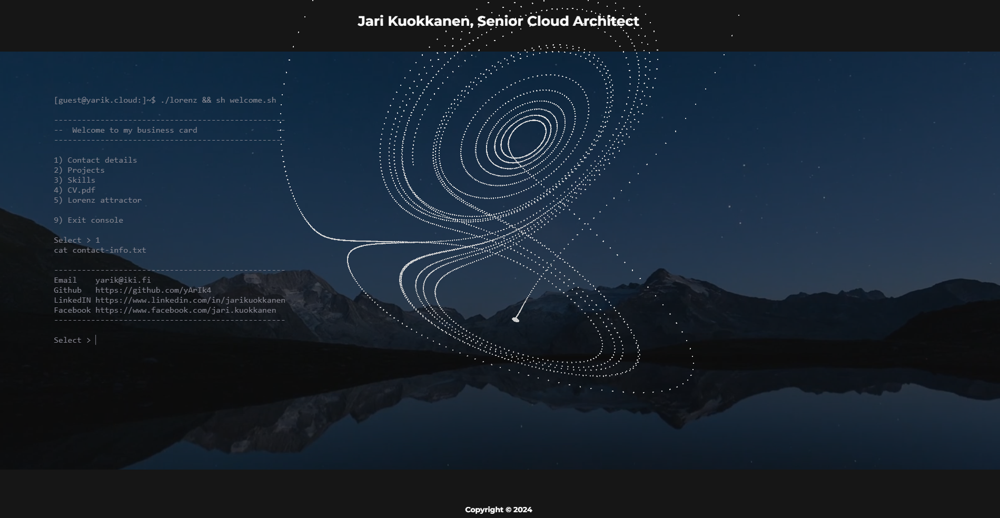

# Business card

### My personal business card

- Made using HTML, CSS and JavaScript with THREE.js
- Semi-responsive layout - really not usable on mobile yet
- TODO: Buttons for mobile screens

&nbsp;

### About the Lorenz attractor

This is a re-creation of one chapter of my original demo made in 80's.
Back then it was coded in assembly to Amiga 500 and later to PC/486, with Motorola MC68k and Intel 80486 CPU's respectively, and took each time few weeks to finish so that it played perfectly smoothly.

Those machines were seriously limited by CPU power as no GPU's existed - although 80486 had a FPU but with too poor performance to be used in realtime calculations - and so all kinds of tricks needed to be utilized, like calculating only single new point per refresh loop and using fixed point arithmetics, to name few.

The task of redrawing and 3D-rotating this many points (most probably not even this many! :) during each frame refresh (25 fps iirc) was huge task alone and the process consumed almost every cycle from the CPU.

Now the coding took less than hour and composes much less code thanks to advanced THREE.js graphics, and there is no observable CPU load in the host (less than 1% in single core).

For details see: en.wikipedia.org/wiki/Lorenz_system

Copyright (C) 2024 Jari Kuokkanen / yarik@iki.fi

